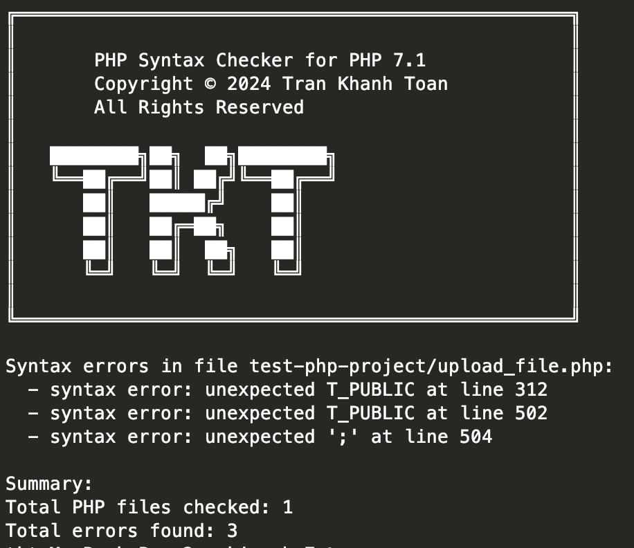

# php-syntax-checker
## For Mac M1
```shell
chmod +x ./php7-syntax-checker-max-m1
./php7-syntax-checker-max-m1 <path to your php project>
```

## For Mac Window
```shell
./php7-syntax-checker-x64.bat <path to your php project>
```


